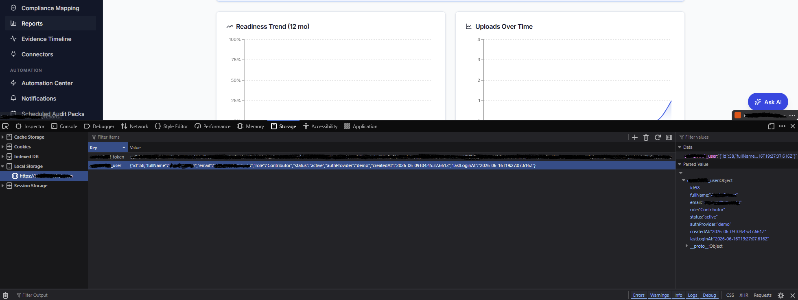

# 01 — Session Token Stored in Browser localStorage

|            |                                                                 |
|------------|-----------------------------------------------------------------|
| Severity   | **High** (Medium in isolation; High when chained with any XSS)   |
| Category   | OWASP A07:2021 — Identification and Authentication Failures      |
| CWE        | CWE-522: Insufficiently Protected Credentials                   |
| Status     | Open                                                            |

## Summary

The application stores its session JWT and a user object (including the user's role) in
browser `localStorage`. Because `localStorage` is fully readable by any JavaScript running
on the page, the session credential cannot be shielded from client-side script and is
exposed to theft in the event of any cross-site scripting (XSS) flaw.

## Impact

A token in `localStorage` cannot be protected with the `HttpOnly` flag the way a cookie can.
Any XSS vulnerability anywhere in the application — or in a third-party script it loads —
lets an attacker read the token and exfiltrate it, enabling full session hijacking / account
takeover. The stored user object additionally discloses identity fields (id, email, role,
full name) to the same script-readable surface.

## Steps to reproduce

1. Authenticate to the application.
2. Open DevTools → **Application / Storage → Local Storage** → select the app origin.
3. Observe the stored keys: an authentication JWT (e.g. `<app>_token`) and a user object
   (e.g. `<app>_user`) containing role and profile fields.
4. Confirm the values are readable from page context via the Console, e.g.
   `localStorage.getItem('<app>_token')`.

## Evidence

*Figure 1 — the session JWT (`<app>_token`) and a user object (`<app>_user`) held in Local Storage and readable from page context. Token value, email, hostname, and client name redacted.*

## Remediation

- Move the session token to a `Secure`, `HttpOnly`, `SameSite` cookie so it is inaccessible
  to page JavaScript.
- Keep only non-sensitive display data in client-readable storage; make all role /
  authorization decisions server-side from the verified token, never from a client-stored value.

## References

- OWASP Top 10 2021 — A07: Identification and Authentication Failures
- CWE-522: Insufficiently Protected Credentials
- OWASP Session Management Cheat Sheet
