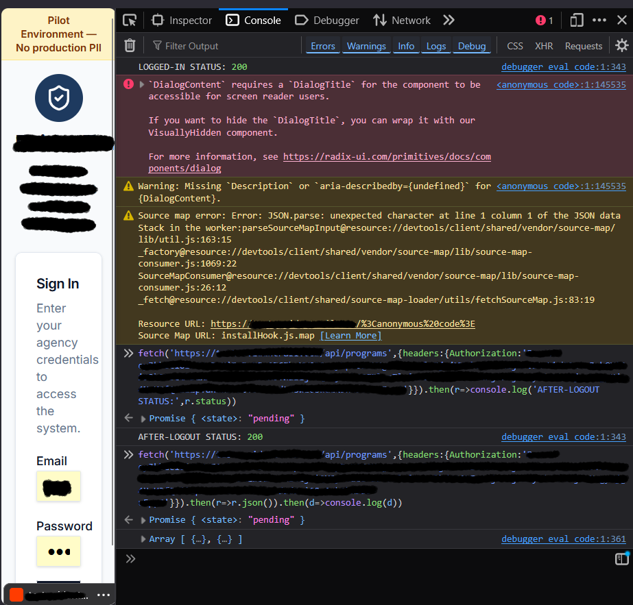

# 02 — Session Token Not Invalidated on Logout (Token Replay)

|            |                                                             |
|------------|-------------------------------------------------------------|
| Severity   | **High**                                                    |
| Category   | OWASP A07:2021 — Identification and Authentication Failures  |
| CWE        | CWE-613: Insufficient Session Expiration                    |
| Status     | Open                                                        |

## Summary

Logging out clears the token from browser storage but does **not** revoke it server-side.
A token captured before logout continues to be accepted by the API after logout, until its
natural expiry.

## Impact

If a valid token is captured before logout — for example on a shared machine, or via the
`localStorage` exposure in [Finding 01](./01-session-token-localstorage.md) — logging out
provides no protection. The token can be replayed against protected API endpoints to read
live session data for the remainder of its lifetime.

The tokens *do* carry a 24-hour expiry (verified in [Finding 05](./05-verified-controls.md)),
so the issue is specifically the **absence of logout-time invalidation**, not an unlimited
lifetime.

## Steps to reproduce

1. Authenticate; copy the session token from browser storage to an external location.
2. Confirm the token is valid — an authenticated request to a protected endpoint
   (e.g. `GET /api/<protected>`) returns **HTTP 200** with data.
3. Log out; confirm the session appears ended in the UI.
4. While logged out, replay the same token: reissue the request with the header
   `Authorization: Bearer <token>`.
5. Compare status codes.

**Result:** the endpoint returned **HTTP 200** and served live data both before *and* after
logout — the token was not invalidated server-side.

## Evidence

*Figure 1 — the token captured pre-logout, replayed after logout, still returns `AFTER-LOGOUT STATUS: 200` with live data. Token, host, and client branding redacted.*

## Remediation

- Invalidate sessions server-side on logout — e.g. a token revocation list / blocklist, or a
  per-user session-version claim checked on every request.
- Prefer short-lived access tokens paired with refresh tokens so the replay window is minimal
  even without explicit revocation.

## References

- OWASP Top 10 2021 — A07
- CWE-613: Insufficient Session Expiration
- OWASP Session Management Cheat Sheet
