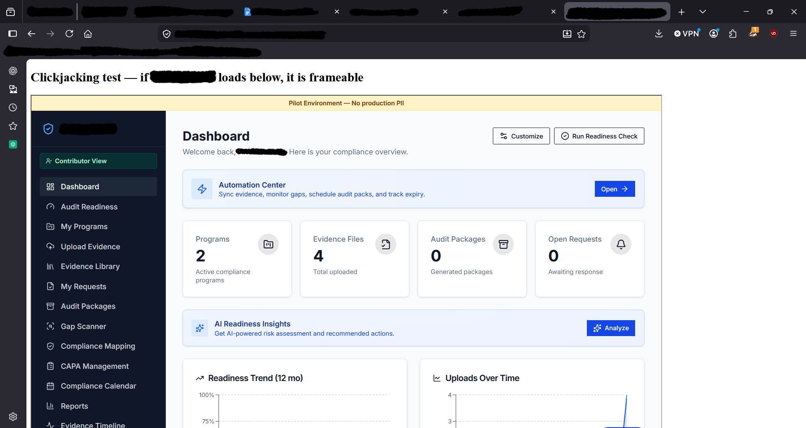

# 03 — Missing Clickjacking Protection (No Anti-Framing Controls)

|            |                                                                        |
|------------|------------------------------------------------------------------------|
| Severity   | **High**                                                               |
| Category   | OWASP A05:2021 — Security Misconfiguration                             |
| CWE        | CWE-1021: Improper Restriction of Rendered UI Layers or Frames        |
| Status     | Open                                                                   |

## Summary

The application sends neither an `X-Frame-Options` header nor a CSP `frame-ancestors`
directive. As a result it can be embedded in an `<iframe>` on any third-party site and
remains fully interactive — including through the login flow.

## Impact

A malicious page can frame the application and overlay deceptive UI on top of it, tricking an
authenticated user into performing unintended actions (clickjacking). Because login itself
functioned inside the frame, the exposure extends to the authentication step, broadening the
attack surface.

## Steps to reproduce

1. Inspect the main document's response headers; confirm no `X-Frame-Options` and no CSP
   `frame-ancestors` directive are present.
2. Create a local HTML file that embeds the application:
   ```html
   <iframe src="https://<target>/dashboard" width="1200" height="800"></iframe>
   ```
3. Open the file in a browser.
4. Observe that the application renders inside the frame and is interactable.

## Evidence



*Figure 1 — the application loads and remains interactive inside a local HTML file's `<iframe>`, confirming it is frameable. Client branding and local file path redacted.*

## Remediation

- Send `X-Frame-Options: DENY` (or `SAMEORIGIN` if same-origin framing is genuinely required).
- Add a Content-Security-Policy with `frame-ancestors 'self'` — the modern control that
  supersedes `X-Frame-Options`. Shared remediation with
  [Finding 04](./04-missing-content-security-policy.md).

## References

- OWASP Top 10 2021 — A05: Security Misconfiguration
- CWE-1021
- OWASP Clickjacking Defense Cheat Sheet
