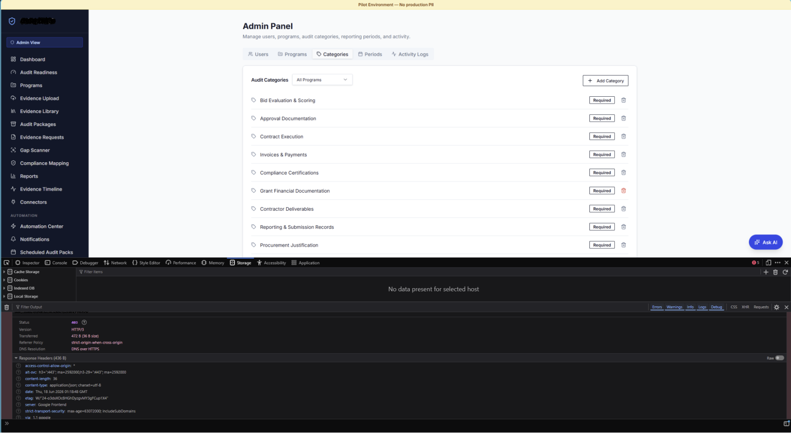
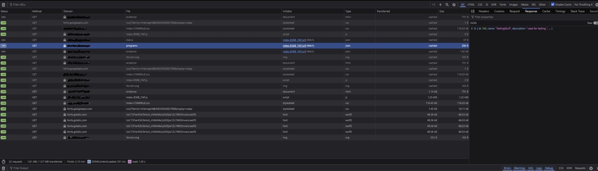
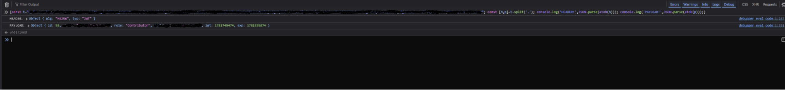

# 05 — Verified Controls: Access Control, JWT Integrity & XSS Resistance

|            |                                                              |
|------------|--------------------------------------------------------------|
| Severity   | Informational (controls confirmed effective)                 |
| Category   | OWASP A01 Broken Access Control / A03 Injection (tested)      |
| Status     | Passed                                                       |

Documenting what was tested and confirmed **secure** is part of a complete assessment. The
following controls held under active testing.

## 5.1 Server-side authorization resists client role tampering — Pass

Editing the client-stored role from `Contributor` to `Admin` caused the admin UI to render,
but the server rejected a privileged action (delete) with **HTTP 403** — no unauthorized
modification was possible. Authorization is correctly enforced server-side.

> **Minor observation (Low):** admin-UI *visibility* is driven by the client role value and
> can be spoofed cosmetically. Recommend gating admin UI on a server-verified role. The spoof
> grants no actual capability.

*Figure 1 — with the client role spoofed to admin, the server still returns 403 on a privileged action.*

## 5.2 Protected API rejects unauthenticated requests — Pass

A logged-out `fetch` to a protected endpoint returned **HTTP 401** with no data.

> **Methodology note:** an earlier address-bar test *appeared* to show data. This was traced
> to a cached **HTTP 304** response from the prior authenticated session, not live server
> output, and confirmed via a clean logged-out Console fetch returning 401. Recording this
> distinguishes a real finding from a caching artifact.

*Figure 2 — the apparent "data exposure" was a cached HTTP 304 response, not live server output. Hostnames redacted.*

## 5.3 JWT is signed with a sane expiry — Pass

The session JWT decodes to header `alg: HS256` (signed) with `exp = iat + 86400` (24-hour
validity) — a reasonable configuration. The payload also exposes id / email / role / name,
which is normal for a JWT (encoded, not encrypted) and not a finding on its own; it is
relevant only because the token lives in script-readable storage
([Finding 01](./01-session-token-localstorage.md)).

*Figure 3 — decoded header (`alg: HS256`) and payload with a 24-hour `exp`. Token string and email redacted.*

## 5.4 Stored XSS via upload filename is neutralized — Pass

Using **Burp Suite** to inject script payloads into the multipart `filename` field —
`.pdf` and `.pdf` (Burp was required
because the host OS disallows those characters in on-disk filenames) — the filenames rendered
as inert, HTML-encoded text in evidence views. No script executed. This closes the most
likely stored-XSS path to the `localStorage` token.

## Why this section matters

Confirming controls, catching a caching false-positive, and validating output encoding show
that findings are **verified before they are reported** — not assumed.
